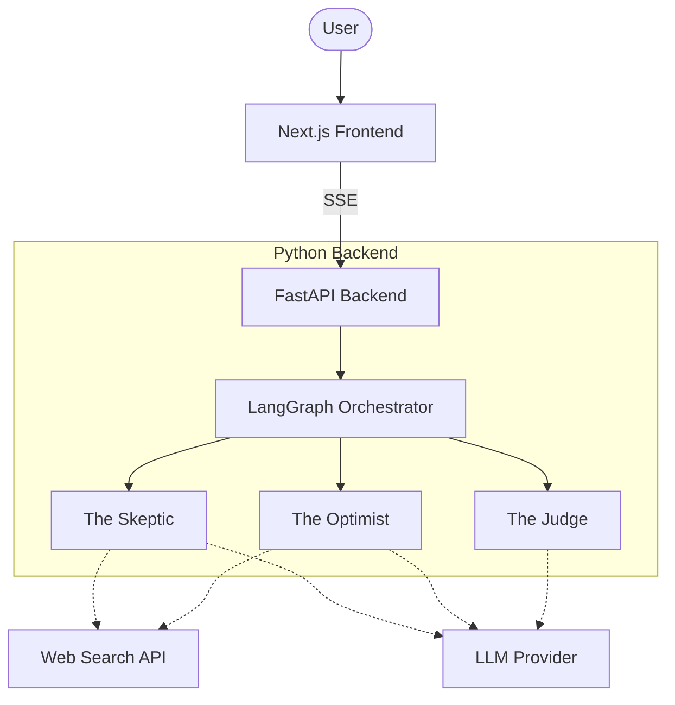

# 🧠 Agentic-Discourse

> A real-time, multi-agent debate platform where AI personas analyze, argue, and synthesize complex topics using live web data.


## 📖 Overview

**Agentic-Discourse** solves the problem of echo chambers and single-perspective research. Instead of asking an LLM a question and getting a single, generic response, you can propose a topic and watch distinct AI personas (The Skeptic, The Optimist, The Judge) debate the topic in real-time.

### Key Features
- **Real-Time Streaming:** Watch the agents type out their thoughts and arguments live.
- **Distinct Personas:** Agents have unique roles and system prompts to ensure a balanced debate.
- **Web Search Integration:** Agents pull live data from the internet to back up their claims.
- **Beautiful UI:** A modern, glassmorphism-inspired chat interface built with Next.js and TailwindCSS.

## 🏗️ Architecture



## 📂 Project Structure

```text
Agentic-discourse/
├── frontend/          # Next.js Application (React, Tailwind, Framer Motion)
├── backend/           # Python FastAPI Application (LangGraph)
├── .github/           # CI/CD Workflows
├── README.md
└── .env.example
```

## 🚀 Getting Started

### Prerequisites
- Python 3.11+
- Node.js 20+

### Backend Setup
```bash
cd backend
python -m venv venv
source venv/bin/activate  # On Windows: venv\Scripts\activate
pip install -r requirements.txt
python main.py
```

### Frontend Setup
```bash
cd frontend
npm install
npm run dev
```

## 🛠️ Built With
* [FastAPI](https://fastapi.tiangolo.com/) - Backend API
* [LangGraph](https://python.langchain.com/docs/langgraph) - Multi-Agent Orchestration
* [Next.js](https://nextjs.org/) - Frontend Framework
* [TailwindCSS](https://tailwindcss.com/) - Styling

## 📝 License
This project is licensed under the MIT License - see the LICENSE file for details.

## ✨ Acknowledgments
Created by [Kamalesh404](https://github.com/kamalesh404).
