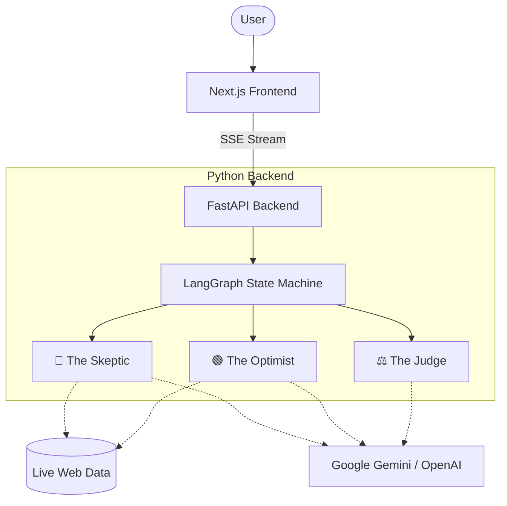

<div align="center">
  
# 🧠 Agentic-Discourse
  
**The Next-Generation Multi-Agent Debate & Synthesis Platform**

[](https://www.python.org/downloads/release/python-3110/)
[](https://nextjs.org/)
[](https://fastapi.tiangolo.com/)
[](https://python.langchain.com/docs/langgraph)
[](https://opensource.org/licenses/MIT)
[](http://makeapullrequest.com)
[](https://github.com/kamalesh404)

*Empowering ideas through adversarial thinking and automated research.*

[Features](#-key-features) • [Architecture](#-architecture) • [Installation](#-quick-start) • [Documentation](#-documentation) • [Contributing](#-contributing)

</div>

---

## 📖 Overview

**Agentic-Discourse** is an advanced open-source platform designed to eliminate echo chambers and enhance decision-making through AI-driven debate. 

Instead of relying on a single LLM output, users submit a topic, startup idea, or hypothesis to a **Multi-Agent Council**. Distinct AI personas (The Skeptic, The Optimist, The Judge) autonomously research the web, construct arguments, critique each other, and finally synthesize a balanced verdict in real-time.

### Why Agentic-Discourse?
- **For Founders:** Validate startup ideas against an AI that actively tries to find reasons it will fail.
- **For Researchers:** Analyze complex topics from multiple perspectives without manual bias.
- **For Developers:** A reference architecture for combining Next.js with LangGraph and FastAPI.

---

## ✨ Key Features

| Feature | Description | Tech Stack |
|---------|-------------|------------|
| ⚡ **Real-Time Streaming** | Watch agents construct arguments and debate live. | Server-Sent Events (SSE) |
| 🎭 **Distinct Personas** | Granular system prompts enforce strict adversarial roles. | LangChain Core |
| 🌐 **Autonomous Web Search** | Agents break out of their training data to cite live web sources. | Tavily API / DuckDuckGo |
| 🧠 **Graph Orchestration** | Deterministic state machine handles turn-taking and context windows. | LangGraph |
| 🎨 **Glassmorphism UI** | A stunning, highly animated, dark-mode-first chat interface. | Next.js, Tailwind, Framer Motion |

---

## 🏗️ Architecture

The project utilizes a strictly decoupled architecture, ensuring scalability and clean separation of concerns.



---

## 🚀 Quick Start

### Prerequisites
- [Node.js](https://nodejs.org/en/) 20.0+
- [Python](https://www.python.org/) 3.11+
- API Keys for Google Gemini or OpenAI

### 1. Clone the Repository
```bash
git clone https://github.com/kamalesh404/Agentic-discourse.git
cd Agentic-discourse
```

### 2. Backend Setup (FastAPI & LangGraph)
```bash
cd backend
python -m venv venv
source venv/bin/activate  # On Windows: venv\Scripts\activate
pip install -r requirements.txt

# Configure environment variables
cp ../.env.example .env
# Edit .env and add your GOOGLE_API_KEY

python main.py
```
*Backend runs on http://localhost:8000*

### 3. Frontend Setup (Next.js)
```bash
cd ../frontend
npm install
npm run dev
```
*Frontend runs on http://localhost:3000*

---

## 📂 Project Structure

```text
Agentic-discourse/
├── .github/
│   ├── ISSUE_TEMPLATE/     # Templates for bug reports and features
│   └── workflows/          # GitHub Actions CI/CD pipelines
├── backend/
│   ├── agents/             # LangGraph Nodes, State, and Graph compilation
│   ├── core/               # Configuration and utilities
│   ├── models/             # Pydantic data schemas
│   ├── main.py             # FastAPI entry point
│   └── requirements.txt    # Python dependencies
├── frontend/
│   ├── src/
│   │   ├── app/            # Next.js App Router and global CSS
│   │   └── components/     # Reusable React components (ChatBubble)
│   ├── package.json        # Node dependencies
│   └── tailwind.config.ts  # Tailwind configuration
├── .env.example            # Environment variable template
├── CODE_OF_CONDUCT.md      # Community guidelines
├── CONTRIBUTING.md         # Guidelines for contributing
├── SECURITY.md             # Security vulnerability reporting
└── README.md               # You are here
```

---

## 🤝 Contributing

We welcome contributions from the community! Whether it's a bug fix, new feature, or documentation improvement, please read our [Contributing Guidelines](CONTRIBUTING.md) first.

1. Fork the Project
2. Create your Feature Branch (`git checkout -b feature/AmazingFeature`)
3. Commit your Changes (`git commit -m 'feat: Add some AmazingFeature'`)
4. Push to the Branch (`git push origin feature/AmazingFeature`)
5. Open a Pull Request

---

## 🛡️ Security

If you discover any security related issues, please refer to our [Security Policy](SECURITY.md) and email the maintainer directly instead of using the issue tracker.

---

## 📄 License

Distributed under the MIT License. See `LICENSE` for more information.

---

<div align="center">
  <b>Built with ❤️ by <a href="https://github.com/kamalesh404">kamalesh404</a></b>
</div>
